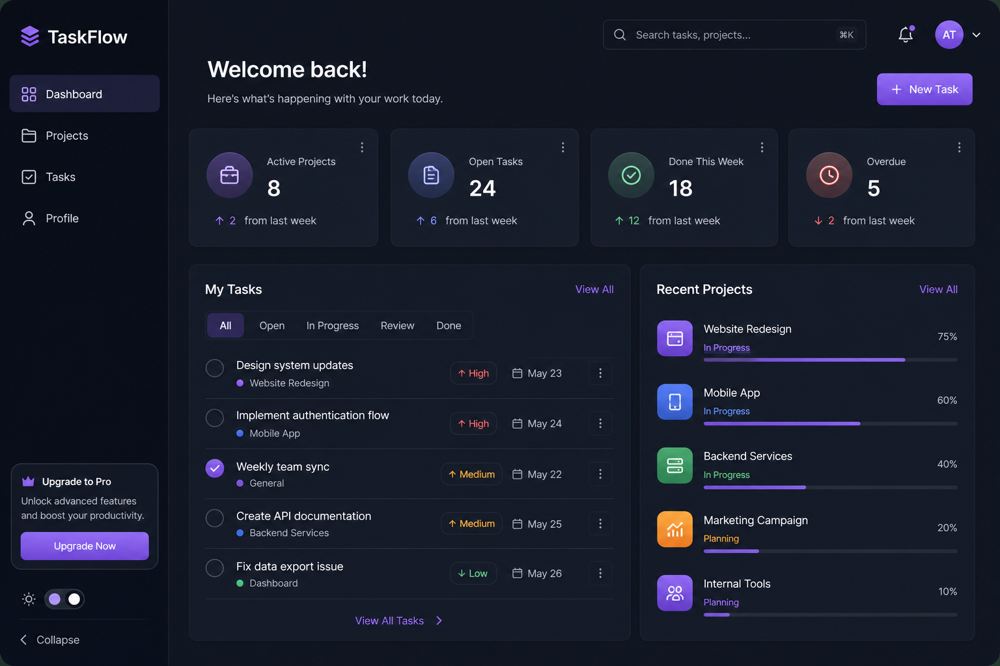
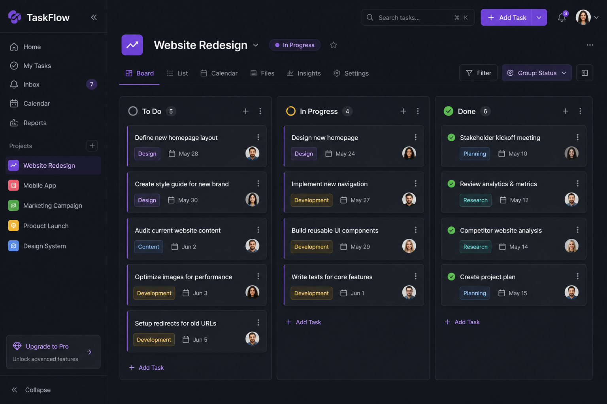

# TaskFlow

[](./LICENSE)
[](https://react.dev/)
[](https://www.typescriptlang.org/)
[](https://vitejs.dev/)
[](https://expressjs.com/)

Team-focused task and project management: authenticated workspace, projects, Kanban-style tasks, invites, and notifications—built as a modern SPA plus REST API.

---

## Project overview

TaskFlow is a full-stack application for organizing work across projects and tasks. Users sign in with Supabase-backed auth, manage projects and memberships, track tasks (including a board view), and receive in-app notifications. The UI is a responsive React client; the backend is a Node/Express API backed by Supabase for data and optional email (Resend) for invitations.

**Highlights for reviewers**

- Clear separation: **React + TanStack Router** frontend, **Express** REST API.
- **Real auth**: JWT from Supabase passed as `Authorization: Bearer` to the API.
- **Practical feature set**: dashboard metrics, project CRUD, tasks, profile, notifications.

---

## Features

- **Authentication** — Login and signup; session via Supabase.
- **Dashboard** — At-a-glance stats, my tasks, recent projects, overdue focus.
- **Projects** — List, search, filter by status; create project; project detail with metadata and members.
- **Tasks** — List and detail views; Kanban board with drag-and-drop-style organization.
- **Collaboration** — Project invites (email when Resend is configured).
- **Notifications** — In-app notification center in the top bar.

---

## Tech stack

| Layer | Technologies |
|--------|----------------|
| Frontend | React 19, TypeScript, Vite, TanStack Router, Tailwind CSS v4, Zustand, React Hook Form, Zod, dnd-kit, Supabase JS client |
| Backend | Node.js 18+, Express, Zod, Supabase (service role), optional Resend |
| Data & auth | Supabase (Postgres + Auth) |

---

## Installation

**Prerequisites:** Node.js 18 or newer, npm, and a Supabase project (URL + anon key for the client; service role for the server).

Clone the repository and install dependencies for both apps:

```bash
git clone <your-fork-or-remote-url> taskflow-app
cd taskflow-app
cd frontend && npm install
cd ../backend && npm install
```

---

## Setup

1. **Supabase** — Create a project and run the SQL schema in `backend/supabase-schema.sql` in the Supabase SQL editor (tables, RLS as defined there).

2. **Backend environment** — In `backend/`, copy or create a `.env` file (see [Environment variables](#environment-variables)).

3. **Frontend environment** — In `frontend/`, copy or create `.env` / `.env.local` with `VITE_*` variables.

4. **CORS** — For production, set `CLIENT_URL` to your deployed frontend origin.

---

## Usage

Run API and web app in separate terminals:

```bash
# Terminal 1 — API (default http://localhost:4000)
cd backend
npm run dev

# Terminal 2 — SPA (default http://localhost:5173)
cd frontend
npm run dev
```

Open the app in the browser, sign up or log in, then use **Projects → New Project** to create a workspace. Task and board flows live under **Tasks** and each **project** page.

**Production build (frontend)**

```bash
cd frontend
npm run build
npm run preview   # optional local check of static output
```

Serve `frontend/dist` with any static host and point `VITE_API_URL` at your deployed API.

---

## UI preview

Representative mockups of the dashboard and project board experience:

<p align="center">
  
</p>

<p align="center">
  
</p>

---

## Folder structure

```
taskflow-app/
├── frontend/          # Vite + React + TanStack Router SPA
│   ├── src/
│   │   ├── components/   # UI, layout, Kanban, modals
│   │   ├── routes/       # File-based routes (dashboard, projects, tasks, auth)
│   │   └── lib/          # API client, auth, store, types
│   └── vite.config.ts
├── backend/           # Express REST API
│   ├── src/
│   │   ├── controllers/
│   │   ├── routes/
│   │   ├── middleware/
│   │   └── schemas/
│   ├── supabase-schema.sql
│   └── index.js
├── docs/
│   └── assets/        # README screenshots
├── README.md
└── LICENSE
```

---

## Environment variables

### Frontend (`frontend/.env`)

| Variable | Description |
|----------|-------------|
| `VITE_SUPABASE_URL` | Supabase project URL |
| `VITE_SUPABASE_ANON_KEY` | Supabase anonymous (public) key |
| `VITE_API_URL` | Backend base URL (default `http://localhost:4000`) |

### Backend (`backend/.env`)

| Variable | Description |
|----------|-------------|
| `PORT` | HTTP port (default `4000`) |
| `SUPABASE_URL` | Same project URL as the client |
| `SUPABASE_SERVICE_ROLE_KEY` | Service role key (server-only; never expose to the browser) |
| `CLIENT_URL` | Frontend origin for CORS and invite links (e.g. `https://app.example.com`) |
| `RESEND_API_KEY` | Optional; enables transactional email for invites |
| `RESEND_FROM` | Optional sender address for Resend |

---

## API integration

- **Base URL** — Configured in the frontend as `VITE_API_URL` (see `frontend/src/lib/api.ts`).
- **Auth** — After Supabase login, the SPA attaches `Authorization: Bearer <access_token>` to API requests.
- **Namespaces** (Express, under `/api`):

  | Prefix | Purpose |
  |--------|---------|
  | `/api/auth` | Sign up, login, session helpers |
  | `/api/dashboard` | Dashboard aggregates |
  | `/api/projects` | Projects and membership |
  | `/api/tasks` | Tasks |
  | `/api/profile` | User profile |
  | `/api/invites` | Invitations |
  | `/api/notifications` | Notifications |

- **Health** — `GET /health` returns `{ "status": "ok" }` for uptime checks.

---

## Deployment

Typical layout:

1. **Database** — Supabase (schema from `backend/supabase-schema.sql`).
2. **Backend** — Deploy the Express app (e.g. Railway, Render, Fly.io, VPS). Set all backend env vars; ensure `CLIENT_URL` matches the SPA origin.
3. **Frontend** — Build with `npm run build`, deploy static files, set `VITE_*` at build time so the client knows API and Supabase endpoints.

Use HTTPS in production and restrict CORS to your real frontend URL via `CLIENT_URL`.

---

## Contributing

Contributions are welcome.

1. Open an issue for larger changes or bugs so direction is aligned early.
2. Fork the repo and create a focused branch (`feature/…`, `fix/…`).
3. Match existing code style (Prettier/ESLint in `frontend`); keep commits readable.
4. Test flows you touch (auth, create project, tasks) against local API + Supabase.
5. Open a pull request with a short description of **what** changed and **why**.

---

## License

This project is licensed under the [MIT License](./LICENSE).
